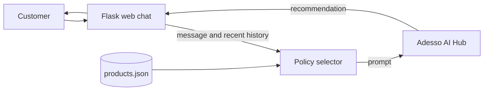

# Mutakamela AI Bot

An insurance assistant for Mutakamela. Explore 44 products across seven lines of business, get product recommendations, and guide customers through quote and claims questions.

<p align="center">
	
</p>

<p align="center">
	
	
	
	
</p>

## Contents

[Features](#features) · [Quick start](#quick-start) · [How it works](#how-it-works) · [Configuration](#configuration) · [API](#api) · [Tests](#tests)

## Quick Start

```bash
python3 -m venv venv
source venv/bin/activate
pip install -r requirements.txt
cp .env.example .env
```

Add your `ADESSO_API_KEY` to `.env`, then start the web chat:

```bash
python web_chat.py
```

Open `http://127.0.0.1:5000`. Alternatively, `./run_chat.sh` creates the virtual environment, installs dependencies, and starts the same app.

For the standalone selector, run `python policy_selector.py`. It uses OpenAI when `OPENAI_API_KEY` is set and falls back to local rule-based matching otherwise. `policy_selector_adesso.py` is the conversational Adesso-backed CLI and requires `ADESSO_API_KEY`.

## Features

- Browse recommendations from 44 products across motor, health, travel, property, marine, liability, and engineering.
- Chat in English or Arabic, with persisted browser conversation history.
- Continue quote and claims conversations with contextual quick replies.
- Use the standalone selector with OpenAI or its local rule-based fallback.
- Run the Flask web interface with request validation, per-client rate limits, and same-origin defaults.

Chat requests are limited to 20 per minute per client address by default. Set `CHAT_RATE_LIMIT` to change the limit. The default in-memory rate-limit store is for a single process; multi-worker deployments should set `RATELIMIT_STORAGE_URI` to a shared store such as Redis. Same-origin requests do not need CORS; set `CORS_ORIGINS` to a comma-separated allowlist only when using a separate frontend origin.

## How It Works

The web client sends the current message and a bounded transcript to Flask. The selector combines that context with the product catalog and calls the configured Adesso-compatible AI service.



## Product Catalog

| LOB | Products |
|-----|----------|
| MOTOR | TPL, Comprehensive (Silver/Gold/Platinum), Fleet, Motorcycle |
| HEALTH | Individual, Family, Corporate, VIP, Maternity, Dental |
| TRAVEL | Single Trip, Annual, Schengen, Hajj/Umrah, Student |
| PROPERTY | Home Basic/Comprehensive, Commercial, Industrial, Landlord |
| MARINE | Cargo, Hull, Freight Forwarder, Inland Transit |
| LIABILITY | Public, Professional, D&O, Product, Employer, Cyber |
| ENGINEERING | CAR, EAR, Machinery, Electronic, Decennial, Plant |

## Example Requests

```text
I need car insurance              -> Motor TPL
travel to Europe                  -> Schengen Visa Travel
insure my construction project    -> Contractor All Risk
health for company employees      -> Corporate Health Insurance
```

## Configuration

Copy `.env.example` to `.env` and set the credentials for the interface you plan to run:

| Variable | Purpose |
|----------|---------|
| `ADESSO_API_KEY` | Required by the Adesso web chat and conversational CLI. |
| `ADESSO_API_BASE` | Optional Adesso-compatible API URL. |
| `MODEL_NAME` | Optional model name; defaults to `gpt-4.1-mini`. |
| `OPENAI_API_KEY` | Optional; enables AI mode in `policy_selector.py`. |
| `CHAT_RATE_LIMIT` | Requests per client address; defaults to `20 per minute`. |
| `RATELIMIT_STORAGE_URI` | Defaults to in-memory storage; use shared storage such as Redis with multiple workers. |
| `CORS_ORIGINS` | Optional comma-separated origin allowlist for a separately hosted frontend. |
| `HOST`, `PORT`, `FLASK_DEBUG` | Server binding, port, and development debug mode. |

The web chat binds to `127.0.0.1` with debug mode off by default. The built-in Flask server is for local development; deploy behind a production WSGI server.

## API

| Route | Method | Purpose |
|-------|--------|---------|
| `/` | `GET` | Web chat interface. |
| `/api/chat` | `POST` | Send a message and recent conversation history. |
| `/api/health` | `GET` | Health check. |

## Tests

```bash
PYTHONPATH=. python -m unittest discover -s . -p 'test_web_chat.py' -v
```

See [`WHATSAPP_SETUP.md`](WHATSAPP_SETUP.md) for WhatsApp integration details.
