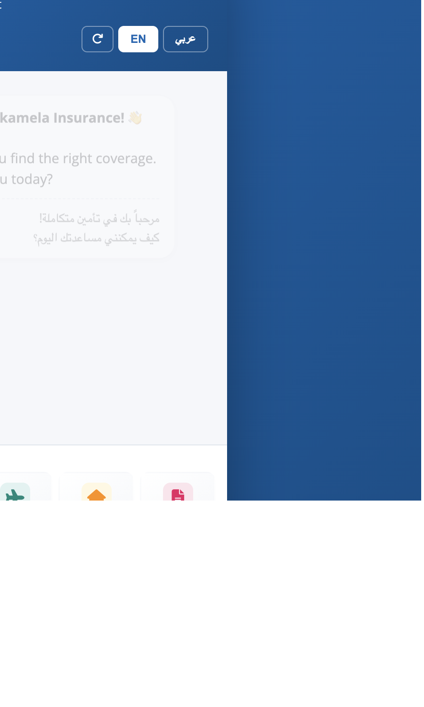
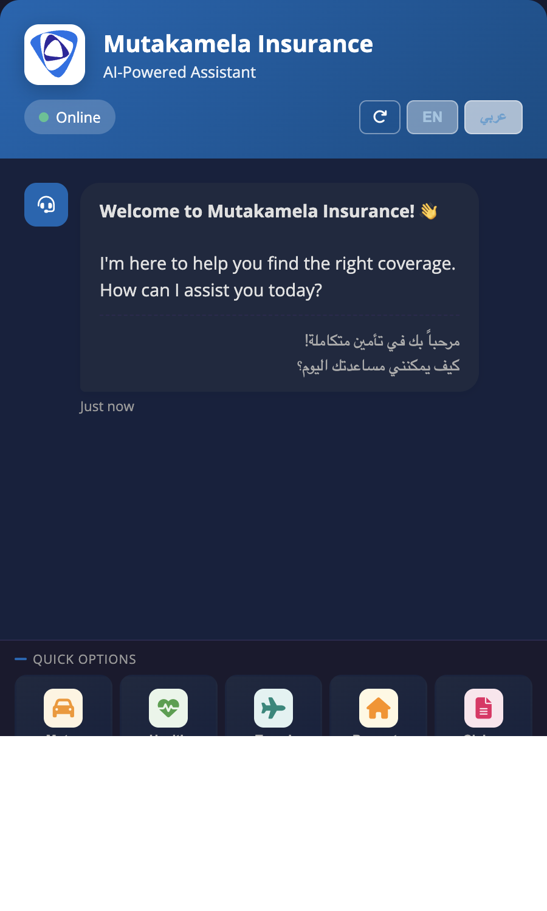
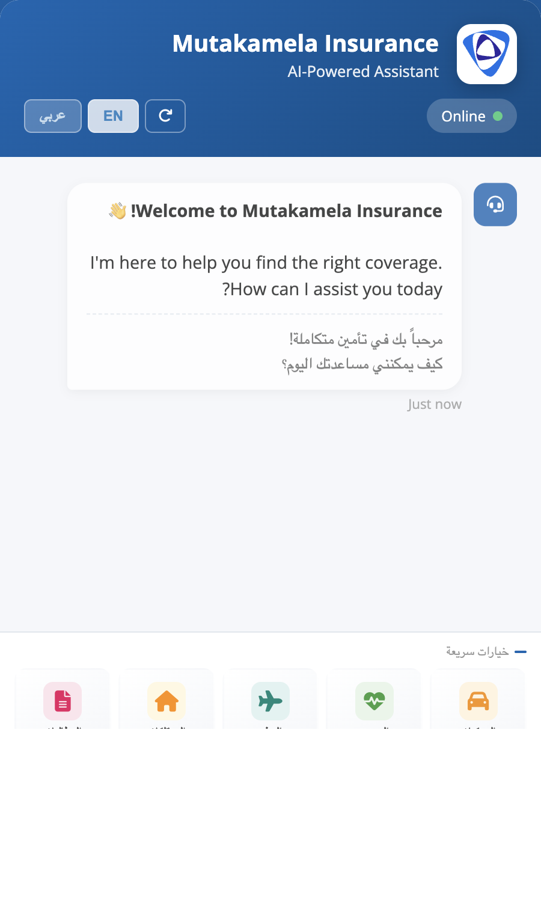
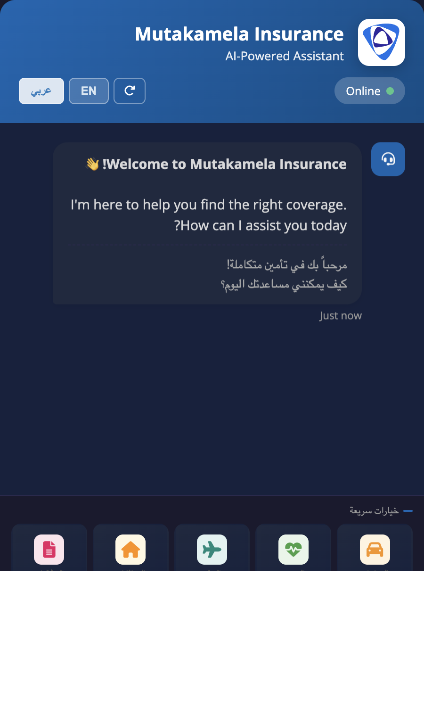
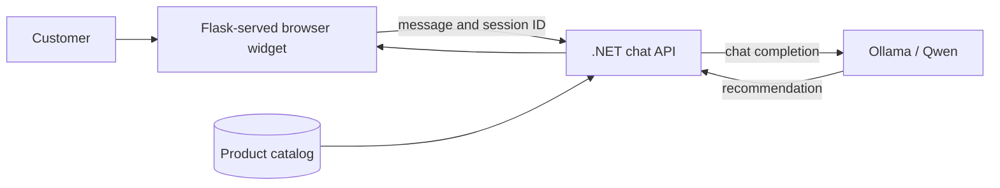

# Mutakamela AI Bot

An insurance assistant for Mutakamela. Browse the 27 product records currently loaded in the local catalog across 11 lines of business, get product recommendations, and guide customers through quote and claims questions. The local catalog may not represent the complete official product inventory.

## Screenshots

| Language | Light mode | Dark mode |
|:--|:--:|:--:|
| English |  |  |
| العربية |  |  |

<p align="center">
	
	
	
	
</p>

## Contents

[Features](#features) · [Quick start](#quick-start) · [How it works](#how-it-works) · [Configuration](#configuration) · [API](#api) · [Tests](#tests)

## Quick Start

Prerequisites: Python 3, the .NET 8 SDK, and [Ollama](https://ollama.com).

```bash
python3 -m venv venv
source venv/bin/activate
pip install -r requirements.txt
cp .env.example .env
ollama pull qwen3:8b
```

Start the .NET API from the repository root in one terminal:

```bash
cd backend
DOTNET_ROLL_FORWARD=Major ASPNETCORE_ENVIRONMENT=Development ASPNETCORE_URLS=http://localhost:5000 dotnet run --project MutakamelaAPI/MutakamelaAPI.csproj
```

Start the browser widget from the repository root in a second terminal, with the Python virtual environment activated:

```bash
PORT=5001 DOTNET_API_BASE_URL=http://localhost:5000 python web_chat.py
```

Open `http://localhost:5001`. The widget sends chat and reset requests directly to the .NET API; it does not need an AI provider key. Swagger UI is available at `http://localhost:5000/swagger` and the API health check is at `http://localhost:5000/api/health`.

The separate Python selector and legacy Flask `/api/chat` endpoint remain available. Those legacy paths use `conversation_policy_selector.py` and require `OPENAI_API_KEY`; they are not used by the Qwen-backed browser widget.

## Features

- Browse recommendations from the 27 product records currently loaded across 11 lines of business.
- Chat in English or Arabic, with browser-persisted conversation history.
- Prepare an in-memory claim draft with policy reference, incident date/description, and preferred contact; review and confirm it in chat.
- Explore product details in chat; quote, payment, and policy requests are handed off to Mutakamela's official site.
- Use the standalone selector with OpenAI or its local rule-based fallback.
- Use the existing Flask-served web widget with the .NET chat API and local Qwen model.
- Start claim submission or claim tracking directly from chat. Filing opens Mutakamela's motor-claim identity gate; identity details, National Information Center authorization, the later claim form, and final submission stay on the official portal and under the customer's control. Tracking asks for the claim number, opens the public Claim Center page, and prefills that number when the browser extension is active. The customer enters their ID/Iqama/CR and clicks **Track Status** themselves; chat does not submit the lookup or claim to the portal, and does not claim to have retrieved the resulting status.
- When the complaint flow asks which product the complaint is about, customers can select it directly inside that chat message using the official product list. At the final complaint step, the chat shows one **Choose file** action; selecting supported documents opens the official complaint form and attaches them automatically through the Chrome/Edge extension. Files remain local to the browser and bypass the chat/API/model. Supported formats are PDF, JPG, JPEG, DOC, and DOCX, up to 2 MB each. The extension removes its temporary local copies after attachment, cancellation, tab close, or expiry. Review all details and attachments and click Submit yourself; the assistant never submits the complaint.
- Use the optional Chrome/Edge extension in `browser-extension/` to open the matching Mutakamela portal tab automatically after a journey is ready. It prefills the verified claim-number field on the public tracker; the identity number, tracking lookup, consent, portal login, review, and claim submission remain customer-controlled.
- For open-ended insurance questions, the local Qwen model receives the full local product catalog plus relevant text retrieved from published Mutakamela pages discovered through the official sitemap. This grounds its natural-language interpretation; it does not fine-tune Qwen or provide full policy wording. Pricing, eligibility and exclusions are only stated when supported by the supplied source material.

Chat requests are limited to 20 per minute per client address by default. Set `CHAT_RATE_LIMIT` to change the limit. The default in-memory rate-limit store is for a single process; multi-worker deployments should set `RATELIMIT_STORAGE_URI` to a shared store such as Redis. Same-origin requests do not need CORS; set `CORS_ORIGINS` to a comma-separated allowlist only when using a separate frontend origin.

## How It Works

The Flask app serves the branded page. The browser sends messages to the .NET API, which maintains the chat session, adds product context, and calls the configured OpenAI-compatible model endpoint. The default endpoint is local Ollama.



## Product Catalog

| LOB | Catalog records |
|-----|-----------------|
| MOTOR | Motor Insurance (1) |
| TRAVEL | Travel Insurance, Visit Visa Travel Insurance (2) |
| SAVINGS | Education Savings, Retirement Savings (2) |
| PROTECTION | Family Protection (1) |
| HEALTH | Corporate Health, Medical SME, Group Personal Accident, Group Life (4) |
| MARINE | Cargo, Hull, Inland Transportation (3) |
| PROPERTY | Property & Casualty (1) |
| LIABILITY | Public, Directors & Officers, Product, Professional Indemnity, Clinical Trials (5) |
| ENGINEERING | Contractors All Risks, Erection All Risks, Machinery Breakdown, Electronic Equipment, Contractors Plant & Machinery, Boiler & Pressure Vessel (6) |
| CREDIT | Trade Credit (1) |
| PECUNIARY | Pecuniary Insurance (1) |

## Example Requests

```text
I need car insurance              -> Motor TPL
travel to Europe                  -> Schengen Visa Travel
insure my construction project    -> Contractor All Risk
health for company employees      -> Corporate Health Insurance
I want to file a claim            -> Claim draft intake and review
```

The claim flow is a prototype: draft fields stay in API memory and the browser's local chat history, and confirmation does not submit a claim. Use synthetic data for testing. Payment or card credentials are rejected; submit claims and provide any required financial information only through an authorized, secure Mutakamela process.

## Configuration

Copy `.env.example` to `.env` for the Flask widget settings. The local Qwen-backed browser flow requires no AI provider key.

| Variable | Purpose |
|----------|---------|
| `DOTNET_API_BASE_URL` | .NET API base URL used by the browser widget; defaults to `http://localhost:5000`. |
| `PORT` | Flask widget port; use `5001` when the .NET API uses `5000`. |
| `AI__BaseUrl` | .NET AI endpoint; defaults to Ollama at `http://localhost:11434/v1`. |
| `AI__Model` | .NET model name; defaults to `qwen3:8b`. |
| `AI__ApiKey` | Optional bearer key for a secured remote OpenAI-compatible endpoint. Not needed for local Ollama. |
| `OPENAI_API_KEY`, `OPENAI_BASE_URL`, `OPENAI_MODEL` | Legacy Python selector/Flask API settings; the base URL defaults to OpenAI's API. |
| `CHAT_RATE_LIMIT` | Requests per client address; defaults to `20 per minute`. |
| `RATELIMIT_STORAGE_URI` | Flask rate-limit storage; use a shared store such as Redis with multiple workers. |
| `CORS_ORIGINS` | Flask legacy API origin allowlist. The .NET API also needs restrictive CORS settings before production. |
| `HOST`, `PORT`, `FLASK_DEBUG` | Server binding, port, and development debug mode. |

Ollama must be reachable from the .NET API. Keep it on a private network in production; do not expose its local inference port publicly. The built-in Flask server is for local development; deploy the widget behind a production WSGI server.

## Automatic portal opening and autofill

For local Chrome or Edge development, install the unpacked extension:

1. Open `chrome://extensions` (Chrome) or `edge://extensions` (Edge) and enable Developer mode.
2. Choose **Load unpacked** and select the repository's `browser-extension` folder.
3. Reload the unpacked extension after code updates, then reload the chat page at `http://localhost:5001`.

At the final complaint step, choosing a file in the chat opens the official form and transfers the selected documents automatically. This requires the extension to be installed and reloaded in Chrome or Edge. After the customer submits the official complaint form, the extension detects the portal's success confirmation and relays the confirmation and complaint number (when shown) to the original chat tab. Other portal handoffs open their matching official URL in a new tab. The extension fills only matching fields from a verified flow and displays a reminder to review them. It never fills OTP, password, or payment fields and never clicks a continue or submit button.

The complaint form flow is marked `verified: true` after checking its selectors against the live form. Other flow specifications remain `verified: false`; for those, the extension opens the portal but deliberately sends no customer values and performs no autofill. Verify the selectors in `backend/MutakamelaAPI/Browser/Flows/*.json` before setting another flow to `verified: true`. The extension's chat-origin allowlist currently targets the local widget at port 5001; update the manifest and `CHAT_ORIGINS` in `browser-extension/service-worker.js` before using a different trusted chat origin.

## API

| Route | Method | Purpose |
|-------|--------|---------|
| `http://localhost:5001/` | `GET` | Branded browser chat widget. |
| `http://localhost:5000/api/chat` | `POST` | .NET chat endpoint used by the widget and direct tests. |
| `http://localhost:5000/api/chat/{sessionId}` | `DELETE` | Clear a .NET chat session. |
| `http://localhost:5000/api/health` | `GET` | .NET API health check. |
| `http://localhost:5000/swagger` | `GET` | Interactive .NET API documentation. |
| `http://localhost:5001/api/chat` | `POST` | Legacy Flask conversation endpoint. |

## Tests

```bash
PYTHONPATH=. python -m unittest discover -s . -p 'test_web_chat.py' -v
```

See [`documents/WHATSAPP_SETUP.md`](documents/WHATSAPP_SETUP.md) for WhatsApp integration details.
