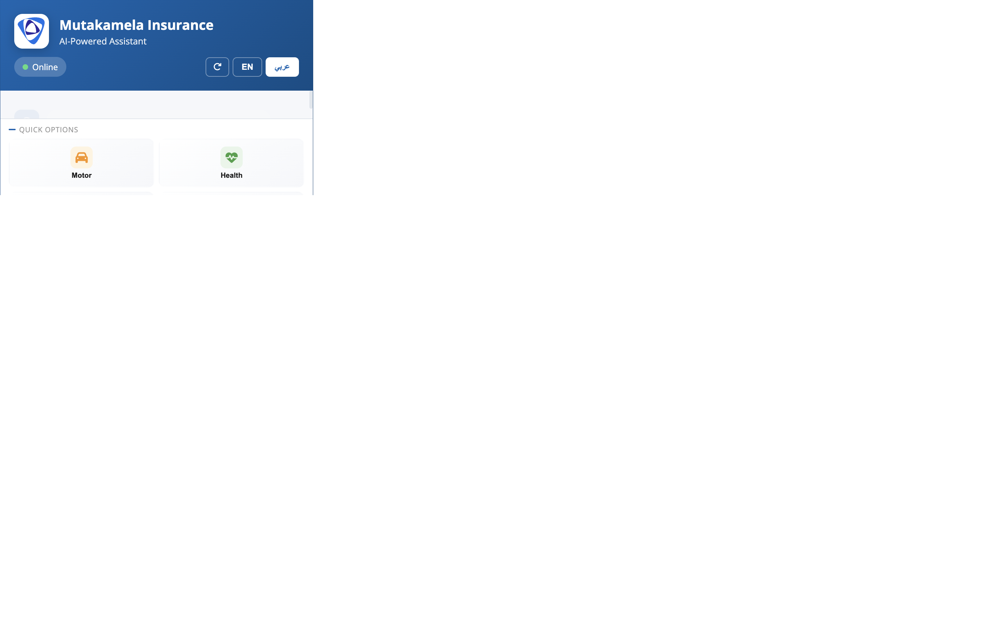
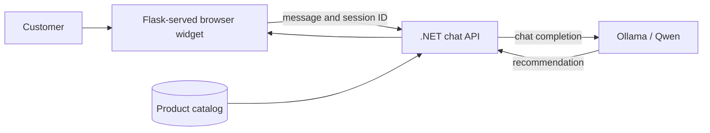

# Mutakamela AI Bot

An insurance assistant for Mutakamela. Explore 44 products across seven lines of business, get product recommendations, and guide customers through quote and claims questions.

<p align="center">
	
</p>

<p align="center">
	
	
	
	
</p>

## Contents

[Features](#features) · [Quick start](#quick-start) · [How it works](#how-it-works) · [Configuration](#configuration) · [API](#api) · [Tests](#tests)

## Quick Start

Prerequisites: Python 3, the .NET 8 SDK, and [Ollama](https://ollama.com).

```bash
python3 -m venv venv
source venv/bin/activate
pip install -r requirements.txt
cp .env.example .env
ollama pull qwen3:8b
```

Start the .NET API from the repository root in one terminal:

```bash
cd backend
DOTNET_ROLL_FORWARD=Major ASPNETCORE_ENVIRONMENT=Development ASPNETCORE_URLS=http://localhost:5000 dotnet run --project MutakamelaAPI/MutakamelaAPI.csproj
```

Start the browser widget from the repository root in a second terminal, with the Python virtual environment activated:

```bash
PORT=5001 DOTNET_API_BASE_URL=http://localhost:5000 python web_chat.py
```

Open `http://localhost:5001`. The widget sends chat and reset requests directly to the .NET API; it does not need an ADESSO key. Swagger UI is available at `http://localhost:5000/swagger` and the API health check is at `http://localhost:5000/api/health`.

The separate Python selector and legacy Flask `/api/chat` endpoint remain available. Those legacy paths use `policy_selector_adesso.py` and require `ADESSO_API_KEY`; they are not used by the Qwen-backed browser widget.

## Features

- Browse recommendations from 44 products across motor, health, travel, property, marine, liability, and engineering.
- Chat in English or Arabic, with browser-persisted conversation history.
- Prepare an in-memory claim draft with policy reference, incident date/description, and preferred contact; review and confirm it in chat.
- Explore product details in chat; quote, payment, and policy requests are handed off to Mutakamela's official site.
- Use the standalone selector with OpenAI or its local rule-based fallback.
- Use the existing Flask-served web widget with the .NET chat API and local Qwen model.

Chat requests are limited to 20 per minute per client address by default. Set `CHAT_RATE_LIMIT` to change the limit. The default in-memory rate-limit store is for a single process; multi-worker deployments should set `RATELIMIT_STORAGE_URI` to a shared store such as Redis. Same-origin requests do not need CORS; set `CORS_ORIGINS` to a comma-separated allowlist only when using a separate frontend origin.

## How It Works

The Flask app serves the branded page. The browser sends messages to the .NET API, which maintains the chat session, adds product context, and calls the configured OpenAI-compatible model endpoint. The default endpoint is local Ollama.



## Product Catalog

| LOB | Products |
|-----|----------|
| MOTOR | TPL, Comprehensive (Silver/Gold/Platinum), Fleet, Motorcycle |
| HEALTH | Individual, Family, Corporate, VIP, Maternity, Dental |
| TRAVEL | Single Trip, Annual, Schengen, Hajj/Umrah, Student |
| PROPERTY | Home Basic/Comprehensive, Commercial, Industrial, Landlord |
| MARINE | Cargo, Hull, Freight Forwarder, Inland Transit |
| LIABILITY | Public, Professional, D&O, Product, Employer, Cyber |
| ENGINEERING | CAR, EAR, Machinery, Electronic, Decennial, Plant |

## Example Requests

```text
I need car insurance              -> Motor TPL
travel to Europe                  -> Schengen Visa Travel
insure my construction project    -> Contractor All Risk
health for company employees      -> Corporate Health Insurance
I want to file a claim            -> Claim draft intake and review
```

The claim flow is a prototype: draft fields stay in API memory and the browser's local chat history, and confirmation does not submit a claim. Use synthetic data for testing. Payment or card credentials are rejected; submit claims and provide any required financial information only through an authorized, secure Mutakamela process.

## Configuration

Copy `.env.example` to `.env` for the Flask widget settings. The local Qwen-backed browser flow requires no AI provider key.

| Variable | Purpose |
|----------|---------|
| `DOTNET_API_BASE_URL` | .NET API base URL used by the browser widget; defaults to `http://localhost:5000`. |
| `PORT` | Flask widget port; use `5001` when the .NET API uses `5000`. |
| `AI__BaseUrl` | .NET AI endpoint; defaults to Ollama at `http://localhost:11434/v1`. |
| `AI__Model` | .NET model name; defaults to `qwen3:8b`. |
| `AI__ApiKey` | Optional bearer key for a secured remote OpenAI-compatible endpoint. Not needed for local Ollama. |
| `ADESSO_API_KEY`, `ADESSO_API_BASE`, `MODEL_NAME` | Legacy Python selector/Flask API settings only; not used by the integrated widget. |
| `OPENAI_API_KEY` | Optional; enables OpenAI mode in the separate `policy_selector.py` utility. |
| `CHAT_RATE_LIMIT` | Requests per client address; defaults to `20 per minute`. |
| `RATELIMIT_STORAGE_URI` | Flask rate-limit storage; use a shared store such as Redis with multiple workers. |
| `CORS_ORIGINS` | Flask legacy API origin allowlist. The .NET API also needs restrictive CORS settings before production. |
| `HOST`, `PORT`, `FLASK_DEBUG` | Server binding, port, and development debug mode. |

Ollama must be reachable from the .NET API. Keep it on a private network in production; do not expose its local inference port publicly. The built-in Flask server is for local development; deploy the widget behind a production WSGI server.

## API

| Route | Method | Purpose |
|-------|--------|---------|
| `http://localhost:5001/` | `GET` | Branded browser chat widget. |
| `http://localhost:5000/api/chat` | `POST` | .NET chat endpoint used by the widget and direct tests. |
| `http://localhost:5000/api/chat/{sessionId}` | `DELETE` | Clear a .NET chat session. |
| `http://localhost:5000/api/health` | `GET` | .NET API health check. |
| `http://localhost:5000/swagger` | `GET` | Interactive .NET API documentation. |
| `http://localhost:5001/api/chat` | `POST` | Legacy Flask/ADESSO endpoint. |

## Tests

```bash
PYTHONPATH=. python -m unittest discover -s . -p 'test_web_chat.py' -v
```

See [`WHATSAPP_SETUP.md`](WHATSAPP_SETUP.md) for WhatsApp integration details.
